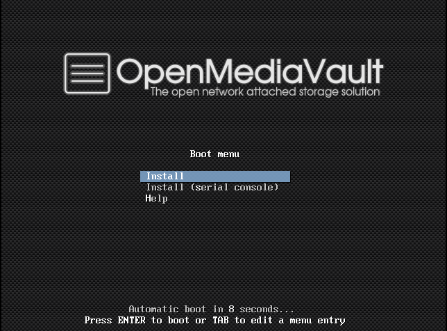
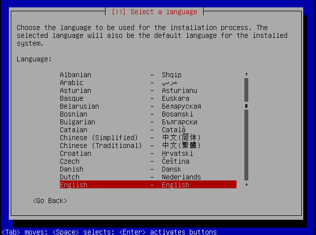
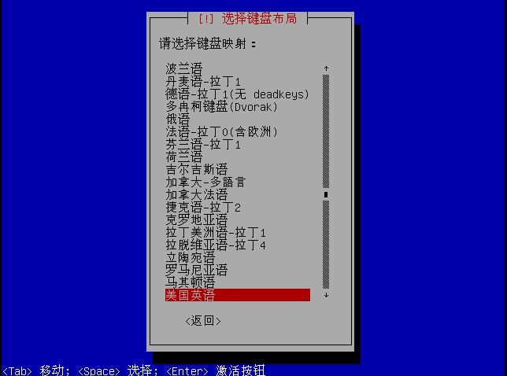
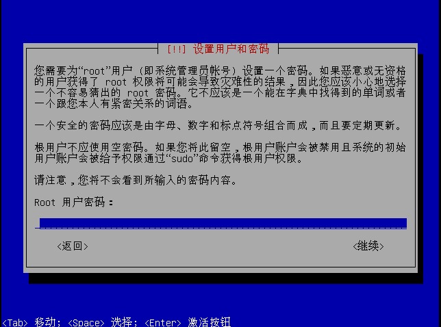
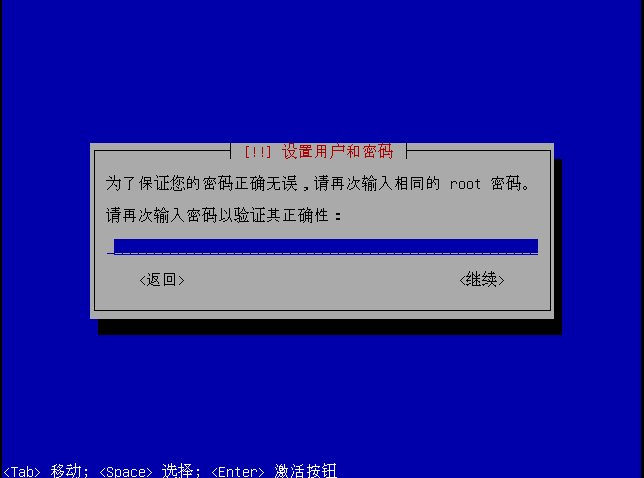
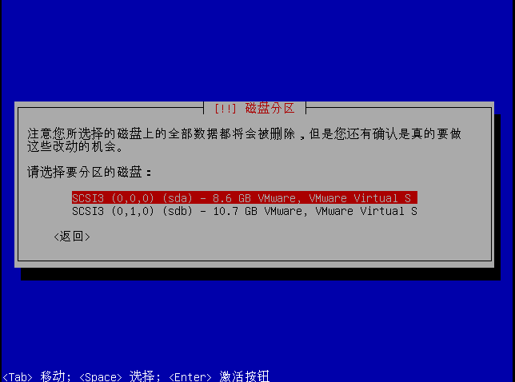
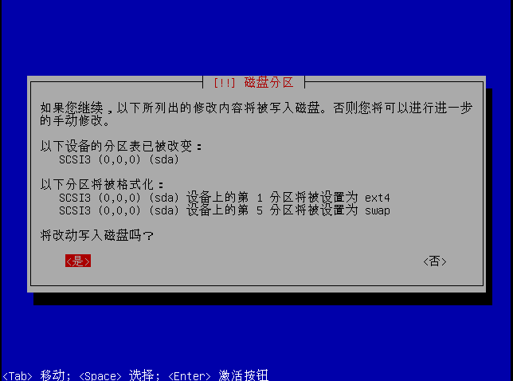
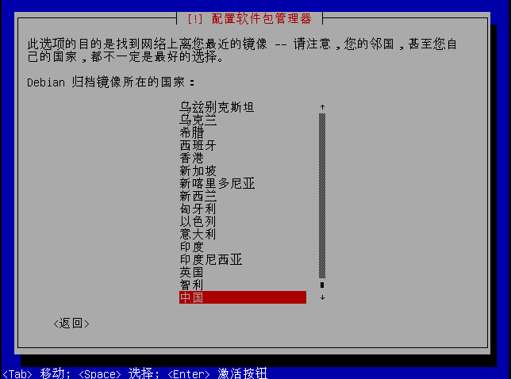
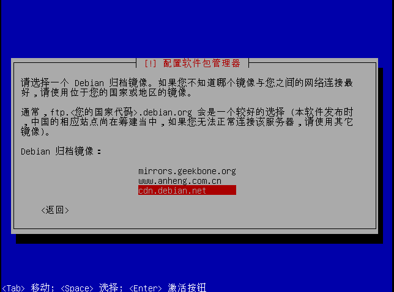
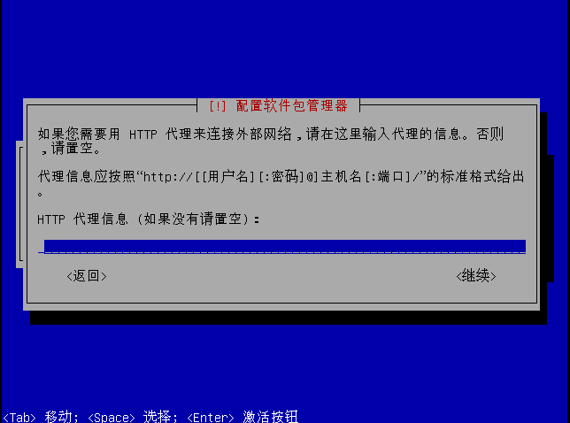

因为项目需要，近来在了解几个开源的NAS系统，在尝试 [Open Media Vault][1] 之前，安装了 [FreeNas 8.3][2] 和 [Nas4Free 9.3][3] 两个系统，这两个系统有很多的相似的地方，毕竟两者是同根生的，但他们两者都有一点不符合我们的要求，而且从我本人的习惯来说，在维护或者但一些修改时，需要的适应期要长一些，他们两者都是基于FreeBSD系统的，前者是FreeBSD 8.3，后者是FreeBSD 9.3。我从开始认识类Unix的系统以来，只在刚开始工作没多久的时候玩过一个星期不到的FreeBSD，而且当时是要维护一个设备，把问题处理之后，就再也没有接触过了。

言归正传，下面来说一下 [Open Media Vault][1] 的安装过程，在尝试安装的过程中，我先后试了两种方式：
* 虚拟机 ISO 安装
* U盘 安装到PC

下面的安装过程以 **虚拟机 ISO安装**方式来展开，其实跟安装别的Linux系统没什么差别;但如果安装的时候可以让机器上网是最佳的，该系统基于Debian，可以apt-get来安装一些更新包;如果是后期再修改source.list就稍显麻烦一些，我是不习惯nano的使用，所以安装完系统就apt-get install了vim。也支持安装相应的应用插件。

## 贴图区

----------------

------------------

然后就自己安装了，安装结束后，重启即可。

[1]: www.openmediavault.org
[2]: www.freenas.com
[3]: www.nas4free.org
